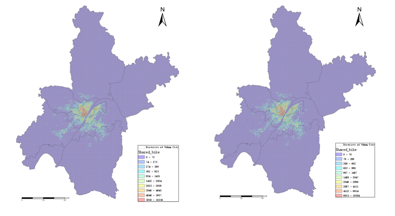
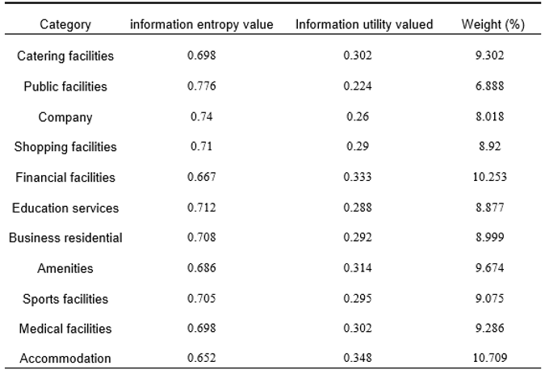
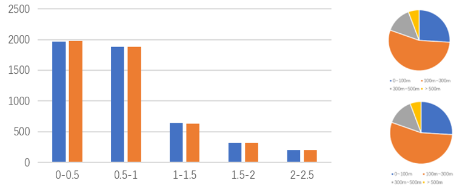
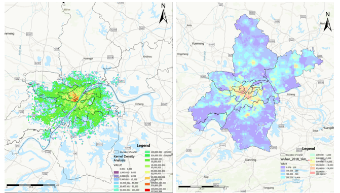
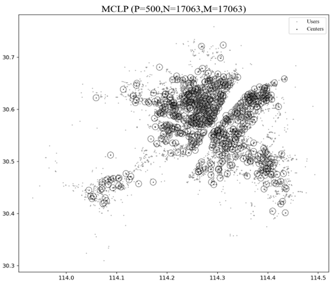

# Shared-Bike-Location-Selection

---

In this project, we conducted data mining on Mobike bicycle trip data and various Points of Interest (POI) in Wuhan City, identifying the key influencing factors for shared bicycle travel.Building upon the Maximum Covering Location Problem (MCLP) model, we utilized a genetic algorithm to optimize the selection of bike deployment locations in Wuhan. The optimization results can provide valuable insights to city planners and decision-makers for urban development.

## Data Sources
The shared bike data consists of Mobike GPS location data and covers the period from October 1, 2018, a Monday, to October 7, 2018, a Sunday, in Wuhan city. The dataset includes timestamp information for the vehicles, the shared bike identification numbers, and latitude and longitude information. In total, it comprises 100,342,626 location data points.

Furthermore, Point of Interest (POI) location data was obtained by web scraping from the Amap (AutoNavi Map) website in September 2018. For each POI, the data includes its location, category, and additional information. The dataset covers 14 categories, including dining services, scenic spots, public facilities, companies, shopping services, transportation facilities, financial and insurance services, educational and cultural services, business services, daily life services, sports and leisure services, healthcare services, government institutions and social organizations, and accommodation services.

Additionally, population data for the study area was obtained from the World Pop website and is provided in both 100m and 1km resolutions

## Method
The research methods employed in this study include Kernel Density Analysis, Buffer Analysis, Geographic Detector, and the Maximum Coverage Location Problem Model. In this study, we established a grid system. Within this grid system, we recorded the number of bicycle borrowing and returning points in each grid cell and analyzed their relationship with various influencing factors. We calculated the weight of each influencing factor, thereby obtaining the demand intensity for each grid. The final location selection was optimized to maximize the sum of demand intensities covered by shared bicycle parking points.Specifically, we employed methods such as Kernel Density Analysis and Buffer Analysis to analyze various influencing factors for shared bicycles, including Points of Interest (POI) data, distances to subway and bus stations, and population data. We aggregated multiple Points of Interest to calculate a comprehensive POI index and assigned weights to these influencing factors using Geographic Detectors[13]. We then divided the research area into small square grids with a side length of 100 meters. Within these grids, we computed the numbers of shared bicycle rentals and returns, the POI index, distances to subway and bus stations, and population data. Based on the assigned weights, we calculated the demand intensity for each grid. Considering the demand intensity for each grid and the distribution of demand points, we employed a heuristic algorithm to solve the MCLP model and obtain the final location selection results.

## EXPERIMENTS AND ANALYSIS
### Spatial Distribution of Bike-sharing
We import the bike-sharing trip records extracted from GPS location data, including the bike borrowing statistics table and the bike returning statistics table. Divide the study area into a grid with a size of 1 kilometer, and calculate the number of bike borrowings and returns within each grid cell. Finally, extract the bike-sharing ride destination distribution.

  

###  Factors Influencing the Spatial Distribution of Bike-sharing
#### Points of Interest
Points of Interest (POI) to some extent can represent the level of land development in a particular area and can indicate the economic status of that area. Therefore, analyzing POIs helps establish a direct connection between shared bicycles and economic develop-ment. Through this analysis, we found significant correlations between the distribution of shared bicycles and Points of Interest such as dining, shopping, finance, business, lifestyle services, and sports and leisure. These findings are valuable for studying the usage patterns of shared bicycles. To quantify the impact of Points of Interest on shared bicycle usage, we employed the entropy weight method to calculate the influence of each POI and obtained a comprehensive Points of Interest index through weighted summation.

  

#### Urban Public Transportation Facilities
Shared bicycles provide a crucial solution to the "last-mile" transportation challenge, particularly for short to medium-distance journeys and enhancing connectivity with urban public transportation networks. Existing research highlights the substantial influence of public transportation facility locations on the distribution of shared bicycles. These facilities primarily comprise subway stations and bus stops. To evaluate their correlation with shared bicycle distribution, we conducted separate analyses for these two types of facilities.In our subway station analysis in Wuhan, we employed circular buffer zones with different radii to scrutinize shared bicycle borrowing and returning activities. For bus stops, given their dense presence in Wuhan, we adopted buffer zones with radii of 100 meters, 300 meters, and 500 meters to ensure a reliable analysis without overly broad coverage. In summary, the proximity of shared bicycles to public tran-sportation facilities significantly affects their utilization. We can gauge the accessibility of public transportation for each grid cell by measuring the distance to facility locations. Notably, subway stations and bus stops have distinct impacts on shared bicycle usage, necessitating separate assessments.

  

 
#### Population
Based on the spatial distribution of shared bicycles, we have studied the characteristics of areas with a concentration of shared bicycles, such as a high level of economic development, convenient public transportation, and high population density. Therefore, we conducted an in-depth analysis of the relationship between these characteristics and the usage of shared bicycles.

  

)

## Result
he Maximum Coverage Location Problem (MCLP) is a classic optimization problem that aims to select the best facility locations from a set of possible candidates to maximize the coverage of demand points within a given service range. Typically, this problem involves N demand points and M candidate facility locations. Each facility has a predefined service range within which it can provide service to nearby demand points. In this study, we used a Genetic Algorithm (GA) to solve the MCLP model, identifying 500 deployment points for shared bicycles, each with a service radius of 500 meters. We defined specific parameters, including a maximum of 100 iterations, 25 individuals per generation, with 10 individuals selected for reproduction, and a 30% mutation probability, to address this challenge. The final solution satisfies the maximum demand intensity. 

  

